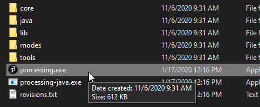
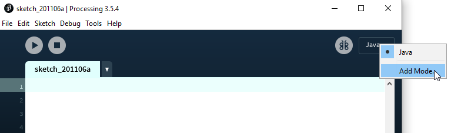
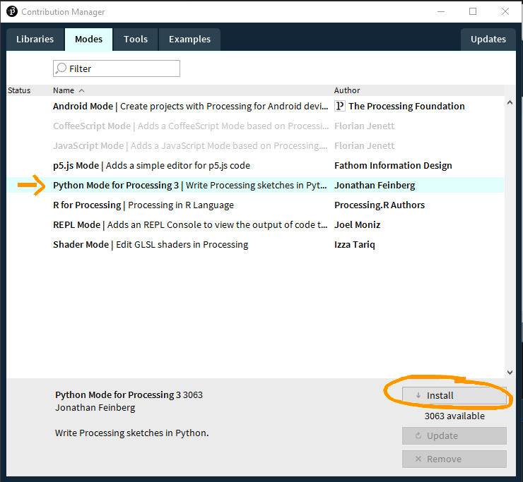
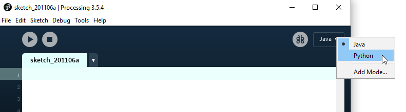

[Table of Contents](README.md)

---

# Processing installation

#### 1. Download and extract the zip: **https://processing.org/download/**
#### 2.  Execute (double-click)

#### 3. Add the Python language mode to processing

#### 4. Change the language of the sketch to Python. 
You might need to restart Processing first.

------

[Next: The Basics](02_basics.md) - [[TOC](README.md)]
